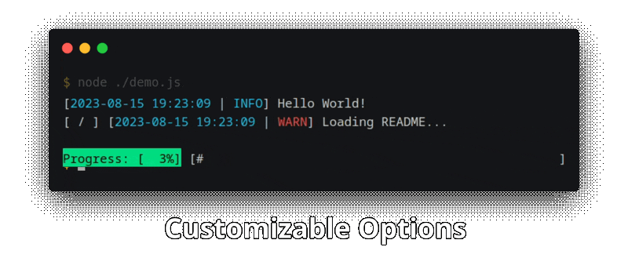

<div align="center">
    <h1>output-logger</h1>
    <h4>Supercharge your CLI presence!</h4>
    <div>
        <a href="#features">Features</a> •
        <a href="#install">Install</a> •
        <a href="#usage">Usage</a> •
        <a href="#functions">Functions</a> •
        <a href="#colors">Colors</a> •
        <a href="#options-1">Options</a>
    </div>
    
</div>

## Features
- Colored log levels: Info, Warn, Error & Debug
- Keep track of every log message with a output file
- Read terminal input from the user
- Display file name to keep track of log origins even in large projects
- Overwrite a log message with the next one by enabling *remove*
- Animations: 6 are shipped by default
- Progress Bars
- Automatic and manual cutting of log lines to the current terminal width
- Customizeable settings: Parameter structure, message structure, disabling of debug messages, etc.

&nbsp; 

## Install
Open a terminal in your project folder and run:  
\> `npm install output-logger`

Do not use the scoped *GitHub Packages* command, it will not work.

&nbsp; 

## Usage  
```js
const logger = require("output-logger");

// Default paramstructure: log level, origin, message, nodate, remove
logger("info", "index.js", "My message", false, true);
```  

This example will output the `info` message `My message` from the file `index.js` with the current date.
It will get overwritten by the next new line in the terminal (but not in the output.txt file).  

The message will also be written to the file `output.txt` stripped of any color codes:  
`[2021-06-14 23:07:35] [INFO | index.js] My message`  

> [!IMPORTANT]
> Some features might not work correctly when starting with a process manager like pm2, unless you use `pm2 attach <process-id>` to view logs.  
> This includes overwriting log messages, animations, progress bars and reading input from the user.  
> Please consider using a normal `node` process to support all features.  

&nbsp; 

## Functions

### (type, origin, message, nodate, remove, animation, cutToWidth, customTimestamp)
- `type` - String that determines the type of the log message. Can be `info`, `warn`, `error`, `debug` or an empty string to not use the field.  
- `origin` - String that will show the origin file of your message. Can be an empty string to not use the field.  
- `message` - String that is your message.  
- `nodate` - Boolean that determines if your message should have no date. If false or undefined the date format will be `YYYY-MM-DD HH:MM:SS`  
- `remove` - Boolean that determines if your message should be removed by the next line. The message will not be removed from the log file.  
- `animation` - Array containing strings for every frame your animation should have or a call to the function animation("name") to use one of the default animations.  
- `cutToWidth` - Boolean that determines if each line of `str` should be force cut to the current terminal width. Setting will be ignored if terminal is not a TTY.  
- `customTimestamp` - Number that changes the timestamp of the message being logged from now to a specific point in time. Overwrites `nodate`. Local timezone offset will be added to this timestamp.  

The order of the parameters above can be changed. Take a look at `paramstructure` below in the 'Options' section!  
  
The message and the type & origin brackets will be colored accordingly to `type`. The date bracket will always be colored cyan.  
This function has no name. To call it call the variable name under which you imported the library.  
Example:  
```
let logger = require("output-logger")
logger("info", "index.js", "My message")
```  

### options({})
- `{}` - Object that contains your custom options. Please see the [Options section](https://github.com/3urobeat/output-logger#options)  

### animation(name)
- `name` - Can be `loading`, `waiting`, `bounce`, `progress`, `arrows` or `bouncearrows`.  
  
This function returns the array of the default animation you chose.  
Provide the function call as the animation parameter to easily use it.  
  
Example: `logger("info", "index.js", "my message", false, false, logger.animation("loading"))`  
  
### stopAnimation()
No parameters.  
Clears the current animation (if one is running).  
You can also just call the logger function again and it will clear any current animation.  

### readInput(question, timeout, (callback))
- `question` - (String) Ask user something before waiting for input. Pass a line break manually at the end of your String if user input should appear below this message, it will otherwise appear behind it. Pass empty String to disable.  
- `timeout` - (Number in ms) Time in ms after which a callback will be made if user does not respond. Pass 0 to disable (not recommended as your application can get stuck)  
- `callback` - (String or null) Called with `input` (String) on completion or `null` if user did not respond in timeout ms.  
  
Reads user input from the terminal and returns it in a callback. logger() calls while waiting for input will be queued and logged after callback was made.  
  
Example:   
```
logger.readInput("What is your name: ", 5000, (input) => {
    if (input) logger("info", "index.js", "User said: " + input)
        else logger("info", "index.js", "User did not respond after 5 seconds!")
})
```  
  
> [!NOTE]
> Any active animation or progress bar, as well as new messages, will temporarily be hidden while `readInput()` is active
  
### stopReadInput(text)
- `text` - (String) Optional: Text that should be logged into the existing input prompt  

Stops an active readInput() prompt and optionally logs text into the running prompt

### createProgressBar()
No parameters.  
Creates new empty progress bar or overwrites existing one.  
This function is optional. You can directly call `increaseProgressBar()` or `setProgressBar()` and it will create a new progress bar automatically if none currently exists.  
  
### removeProgressBar()
No parameters.  
Removes the active progress bar.  
  
### setProgressBar(amount)
- `amount` - Number between 0 and 100 to set the progress bar to.  
  
Set progress of the active progress bar to a specific value.  
> If no progress bar is currently active a new one will automatically be created.  

### increaseProgressBar(amount)
- `amount` - Number between 0 and 100 to increase the progress bar with.  
  
Increases progress of the active progress bar.  
> If no progress bar is currently active a new one will automatically be created.  

### getProgressBar()
No parameters.  
Returns these informations about the active progress bar as an Object:  
- `progress` - Number between 0 and 100 representing the current progress of the active progress bar  

...or `null` if no progress bar is active.

### detachEventListeners()
No parameters.  
Detaches all process event listeners attached by the library.  
This is needed if you re-import the library after clearing the require cache to avoid creating duplicate event listeners.  
(You probably don't need this function if you don't know that you need this function :D)  

&nbsp; 

## Colors
You can easily use color codes in your message by using `logger.colors`!  
Take a look at your IntelliSense popup or look at [the file directly](https://github.com/3urobeat/output-logger/blob/master/lib/data/colors.js) to see all supported colors. 
> `fg` means foreground, `bg` means background. `brfg` and `brbg` mean bright foreground and bright background.  
  
Usage Example:  
```
logger("info", "index.js", `${logger.colors.fgred}This message is red ${logger.colors.fggreen}but now it's green!`)
```
> [!NOTE]
> The library will always reset the color at the end of your message automatically.  
> You can use `logger.colors.reset` to do this manually as well.  
  
> [!TIP]
> Use ``` ` ``` to start and end your string (like in the example) to easily use variables using `${ }`.
  
&nbsp; 

## Options
Call the function `options` and pass an options object to configure the behaviour of the library:  
`logger.options({ outputfile: "./test.txt" })`  

If you don't call this function after importing the library or you leave the object then these default options will be used:  
```
defaultOptions = {
    required_from_childprocess: false,
    msgstructure: `[${logger.Const.ANIMATION}] [${logger.Const.TYPE} | ${logger.Const.ORIGIN}] [${logger.Const.DATE}] ${logger.Const.MESSAGE}`,
    paramstructure: [logger.Const.TYPE, logger.Const.ORIGIN, logger.Const.MESSAGE, "nodate", "remove", logger.Const.ANIMATION, "cutToWidth", "customTimestamp"],
    outputfile: "./output.txt",
    exitmessage: "",
    alwaysCutToWidth: false,
    animationinterval: 750,
    animationinoutputfile: false,
    printdebug: false
}
```  
If you don't provide a specific value then the corresponding default value will be used.  

### required_from_childprocess   (Optional, only needed when you use the lib in multiple processes started by the same application)
Set this to true if you are requiring the library in a child process and the parent process also already required the library.  
This will disable start and exit related cursor movement and line clearing stuff so that both processes can share the same terminal stdout without making conflicting actions, resulting in missing messages etc.

> [!NOTE]
> You need to handle a started animation, progress bar or message with remove enabled from the **same process!**  
> You can't (for example) start an animation from process 1 and expect the other process to clear it when logging. Before process 2 can print, process 1 needs to stop the animation first.

### msgstructure
String that contains supported keywords that will be replaced by the value you give them when calling the logging function. Take a look at the example above where I listed the default values to understand.  
This allows you to customize the structure of your log message.  

### paramstructure  
Array that contains logger.Const strings (except for the raw booleans shown above) in the order you would like to have the parameters of the logger function.  
This allows you to prioritize parameters that you use often by being able to call them before others.  
Take a look at the `defaultOptions` above to see all supported parameters. Shift around the array as you like to change the order.  
If you don't provide all supported parameters then you won't be able to use the parameters you left out.  

Example:  
Setting the paramstructure like this: `paramstructure: [logger.Const.MESSAGE, logger.Const.TYPE, logger.Const.ORIGIN]`  
...will now let you call the logger function like this: `logger("My message", "info", "index.js")`

### outputfile  
String which points to the file the library should write the output to (path). Provide the option but leave the string empty to disable the feature.  

### exitmessage  
A last message that will be printed when the application exits. Leave the string empty to disable the feature.  

### alwaysCutToWidth
Setting this to true will always cut every message to the width of the terminal. This setting only works when the terminal is a TTY!  
If you only want to cut certain messages, check out the `cutToWidth` logger parameter.  
Active animations and messages with `remove` set to `true` will always be cut.  
  
### animationinterval
Time in ms to wait between animation frames.  
  
### animationinoutputfile
Print the first frame of the used animation to the outputfile.

### printdebug
Shows or hides log messages of type "debug".
